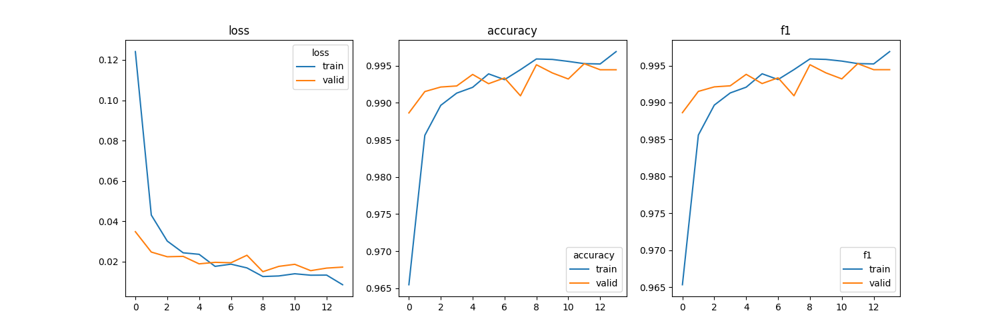
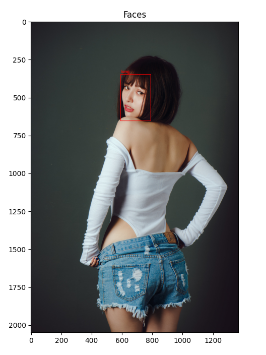
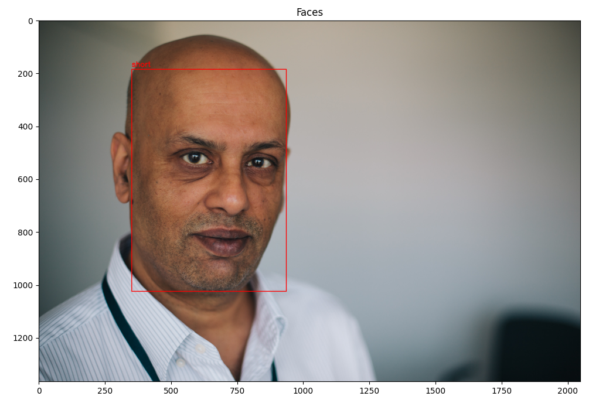
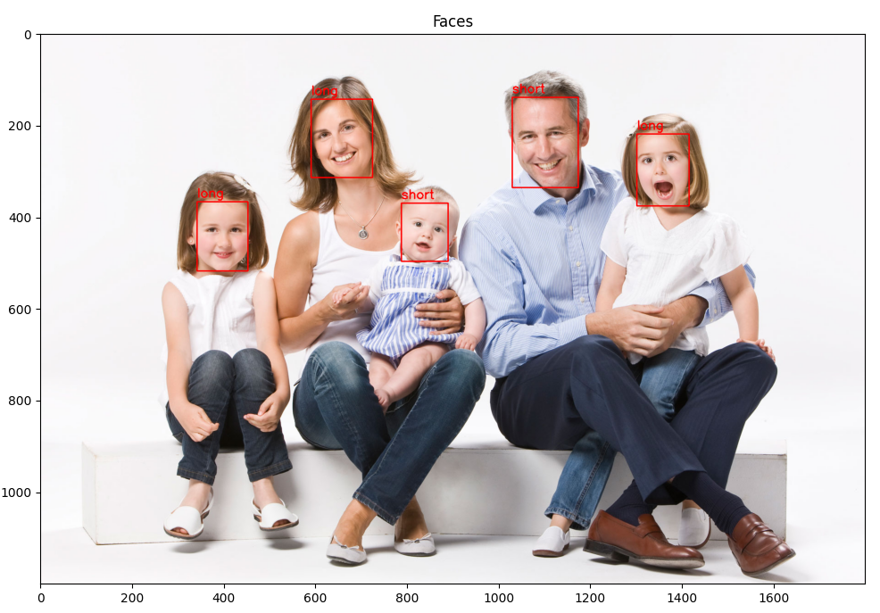

# Hair Classification

Long and short hair classification

### Getting Started

To download project:
```
git clone https://github.com/Vadbeg/BusinessDocumentation.git
```


### Installing
To install all libraries you need, print in `hair-classification` directory: 

```
 pip install -r requirements.txt
```

It will install all essential libraries


## Data

You can download training data [here](https://disk.yandex.com/d/F1IBWls6DxKN8A).
Image examples:


## Model

Mobilenet_v2 model was used as backbone. 
To match model size limitations last 7 *InvertedResidual* blocks were removed. 
Resulted model size equals `1.4MB` with total of `310,786` params. 

## Config

To use script you need to create config. Example:
```buildoutcfg
[Data]

train_images_path = /home/vadbeg/Data/Test/hair/hair-train/data256x256
train_images_long_hair_folder_name = data256x256_longhair
train_images_short_hair_folder_name = data256x256_shorthair

valid_images_path = /home/vadbeg/Data/Test/hair/hair-val

path_to_exclude_file = /home/vadbeg/Projects/Kaggle/hair-classification/bad_train_files.txt


[Model]

weights_dir = /home/vadbeg/Projects/Kaggle/hair-classification/weights
reports_dir = /home/vadbeg/Projects/Kaggle/hair-classification/reports
device = cuda
model_type = mobilenet_v2_small
image_size = [256, 256]
valid_size = 0.3
batch_size = 128
learning_rate = 0.0003
learning_rate_decay_factor = 0.95
num_of_output_nodes = 2
```

## Scripts

#### find_faces.py

```
usage: find_faces.py [-h] [--config-path CONFIG_PATH]

Finds all bad faces in dataset.Bad means no faces or more than one face on image.

optional arguments:
  -h, --help            show this help message and exit
  --config-path CONFIG_PATH
                        Path to config file
```

#### train.py

```
usage: train.py [-h] [--config-path CONFIG_PATH]

Starts training script

optional arguments:
  -h, --help            show this help message and exit
  --config-path CONFIG_PATH
                        Path to config file
```

#### test_dataset.py

```
usage: test_dataset.py [-h] [--config-path CONFIG_PATH] [-i IDX]

Plots item from dataset by given id

optional arguments:
  -h, --help            show this help message and exit
  --config-path CONFIG_PATH
                        Path to config file
  -i IDX, --idx IDX     Index pf item to show
```

#### build_plots_on_report.py

```
usage: build_plots_on_report.py [-h] [--report-path REPORT_PATH]

Draw plots on base of given report

optional arguments:
  -h, --help            show this help message and exit
  --report-path REPORT_PATH
                        Path to report file
```

#### test_model.py

```
usage: test_model.py [-h] [--model-path MODEL_PATH] [--image-path IMAGE_PATH]

Finds all faces on image and checks which kind of hair they have

optional arguments:
  -h, --help            show this help message and exit
  --model-path MODEL_PATH
                        Path to model file
  --image-path IMAGE_PATH
                        Path to image file
```


## Pipeline

First I'd found bad images in dataset using `find_faces.py` script. It returns file with image on which you
can find more than one face or no faces at all. File example:
```
/home/vadbeg/Data/Test/hair/hair-train/data256x256/data256x256_shorthair/05453.jpg, 2
/home/vadbeg/Data/Test/hair/hair-train/data256x256/data256x256_shorthair/26525.jpg, 2
/home/vadbeg/Data/Test/hair/hair-train/data256x256/data256x256_shorthair/02343.jpg, 2
```

Then we can start model training:
```
python train.py --config-path config.ini
```

It will save model weights in `weights_dir` and `reports_dir` in config. You can visualize 
metrics using `build_plots_on_report.py` script:



After model training you can try it on different images with even several faces on it:
```
python test_model.py --model-path=weights/16-05-2021-13\:30\:41.pt --image-path=image.jpg
```






## Additional information

`test_model.py` script adds margin to every face found, which equals 30% of the face size. 
But on images above I draw rectangle only around face for convenience.

## Benchmark

On GTX 1080ti (yep, I have one) model process one face image with speed `~315 it/s`.

## Built With

* [PyTorch](https://pytorch.org) - The NNs framework used
* [Albumentations](https://albumentations.ai) - The augmentation framework used
* [facenet-pytorch](https://github.com/timesler/facenet-pytorch) - Face recognition framework used

## Authors

* **Vadim Titko** aka *Vadbeg* - 
[LinkedIn](https://www.linkedin.com/in/vadtitko/) | 
[GitHub](https://github.com/Vadbeg/PythonHomework/commits?author=Vadbeg)